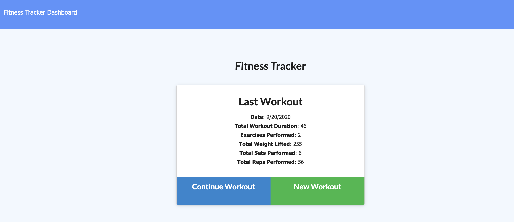
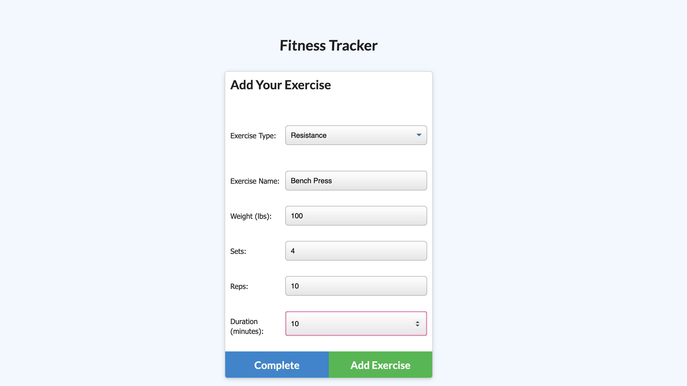
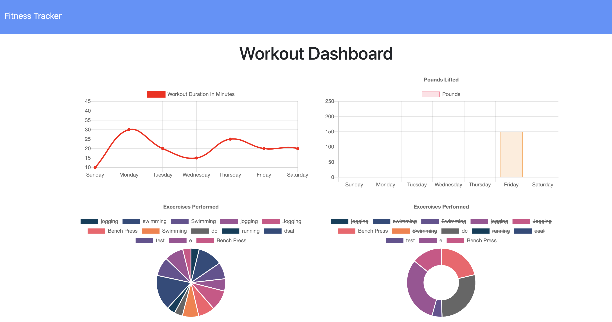

# Fitness Tracker
# Note Taker
  
## Table of Contents
- [Description](#description)
- [Deployed Site](#DeployedSite)
- [Installation](#installation)
- [Contribution](#contribution)
- [Test](#test)
- [License](#license)
- [Questions](#questions)
  
## Description
 An Application that allows the user to record workouts and track the stats. With this application, the user is able to log any workouts from that day, providing information such as name, type, weight, sets, reps, and duration of workout (cardio workout logs also allow the user to track distance).

<!-- Link to video below: -->
## Deployed Site
https://polar-peak-80088.herokuapp.com/?id=5f654c3b23bace0017bb2bdb 
  
  

## Installation
If repository is forked, run "npm i" to install all dependencies.
## Contribution
Yes, please notify if you would like to 
contribute. 
## Test
Run node server.js in the terminal and open 
localhost:3000 manual test the application. Use 
the inspector to show and errors in the 
terminal.
## License
MIT License
Copyright (c) [2020] [Monica Rangel]
  
Permission is hereby granted, free of charge, 
to any person obtaining a copy
of this software and associated documentation 
files (the "Software"), to deal
in the Software without restriction, including 
without limitation the rights
to use, copy, modify, merge, publish, 
distribute, sublicense, and/or sell
copies of the Software, and to permit persons 
to whom the Software is
furnished to do so, subject to the following 
conditions:
  
The above copyright notice and this permission 
notice shall be included in all
copies or substantial portions of the Software.
  
THE SOFTWARE IS PROVIDED "AS IS", WITHOUT 
WARRANTY OF ANY KIND, EXPRESS OR
IMPLIED, INCLUDING BUT NOT LIMITED TO THE 
WARRANTIES OF MERCHANTABILITY,
FITNESS FOR A PARTICULAR PURPOSE AND 
NONINFRINGEMENT. IN NO EVENT SHALL THE
AUTHORS OR COPYRIGHT HOLDERS BE LIABLE FOR ANY 
CLAIM, DAMAGES OR OTHER
LIABILITY, WHETHER IN AN ACTION OF CONTRACT, 
TORT OR OTHERWISE, ARISING FROM,
OUT OF OR IN CONNECTION WITH THE SOFTWARE OR 
THE USE OR OTHER DEALINGS IN THE
SOFTWARE.
## Questions
- Github: https://github.com/Monicarangel95
- Email: joanna.monica@yahoo.com
  